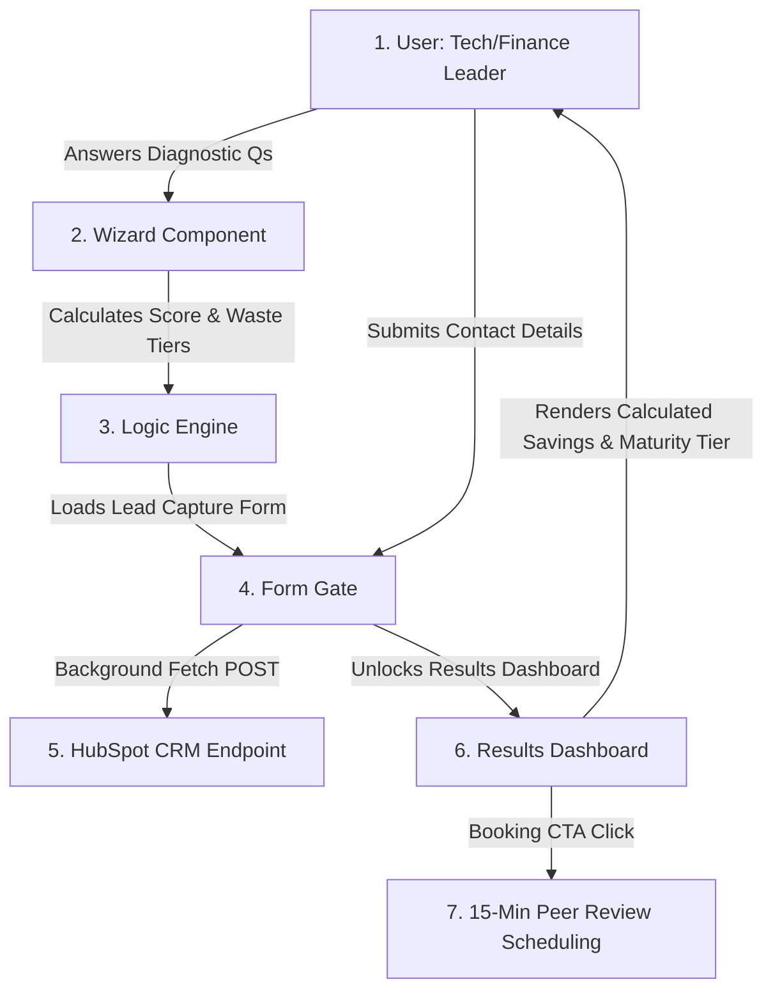

# Higher Ed Data Maturity & Cost Leakage Diagnostic Web App

A clean, premium, high-conversion self-service diagnostic tool for Higher Education IT and Finance leadership. Built to convert traffic into qualified advisory conversations for Ollion.

## File Structure
- `index.html`: The core landing page, diagnostic wizard, lead capture form, results dashboard, and FAQ.
- `index.css`: Premium stylesheet matching **Vibe B (Premium Professional)** styling (warm gray/charcoal background, clean spacing, custom radios, responsive layouts).
- `index.js`: State management, question routing, score calculation, dynamic cloud waste calibrations, and AJAX CRM posting.
- `questions.js`: Decoupled config structure containing the diagnostic questions, scores, and cloud spend tiers.

## Scoring & Financial Waste Formula
- **Maturity Score**: Sum of Level points selected across the 4 pillars (Level 1 = 1pt, Level 2 = 2pts, Level 3 = 3pts). Range: 4 to 12.
- **Estimated Annual Cloud Waste**: 
  - Calibrated based on selected annual cloud budget tier (15% to 30% leakage range).
  - Shown if Cloud Economics pillar score is Level 1 or Level 2. If Level 3 is selected, shows "Optimized" (zero waste).

## Data Flow Diagram



## CRM Integration Guide
To connect the diagnostic form directly to your CRM/HubSpot endpoint:
1. Locate the Portal ID and Form ID in your HubSpot account.
2. In `index.js`, find the `PORTAL_ID` and `FORM_ID` variables inside the `setupFormSubmission()` function.
3. Replace the placeholder strings with your actual HubSpot IDs. The form submission uses background `POST` requests to post lead information together with score values.

## Embedding Options
- **Standalone Landing Page**: Host these files directly on your web server (e.g. `ollion.com/higher-ed-assessment/`).
- **IFrame Integration**: You can embed the interactive diagnostic section (`#diagnostic-app`) inside your existing site using a responsive iframe wrapper:
  ```html
  <iframe src="https://ollion.com/higher-ed-assessment/#diagnostic-app" width="100%" height="650px" style="border:none;"></iframe>
  ```

## Analytics & Tracking Events
Integrate these events inside `index.js` to track user progression and optimize conversion rates:
- **Diagnostic Started**: Fire when the first question radio card is selected.
- **Pillar Completed**: Fire as the user clicks "Continue" on each wizard screen (screens 1-4).
- **Gate Reached**: Fire when the "Calculating..." spinner completes and the lead capture form displays.
- **Lead Captured**: Fire when the user successfully submits the lead form and the Results Dashboard renders.

## A/B Testing Recommendations
To maximize lead conversion:
1. **Headline Test**: Compare the current outcome-oriented headline against a security-oriented headline (*"Is Shadow AI Exposing Your Campus Data? Take the FERPA Diagnostic"*).
2. **Gating Test**: Compare Gating Option A (gate entire results dashboard) against showing a minimal maturity score (e.g., *"Your Score: 7/12 (Transitioning)"*) while gating the detailed cloud leakage calculations and custom 3-step action roadmap.

## Security & Compliance Controls
The application has been audited and hardened according to standard enterprise guidelines:
*   **Privacy Consent**: Incorporates an explicit checkbox with privacy policy referencing. Consent state (`privacy_consent: "true"`) is logged and transmitted directly to the CRM database to maintain GDPR/FERPA audit integrity.
*   **PII Sanitization (CWE-532)**: Removed all console logs containing form variables or error data to prevent PII exposure inside the client's browser console.
*   **Anti-Spam / Anti-Automation (OWASP API4)**: A client-side honeypot field is embedded into the lead form. Spam bots completing this field will have their submissions silently dropped.
*   **Reverse Tabnabbing Mitigation (CWE-1022)**: All links referencing target `_blank` include `rel="noopener noreferrer"`.
*   **DOM-XSS Prevention (CWE-79)**: Dynamic template updates are handled using the internal `escapeHtml()` utility to prevent unescaped template injection.
*   **Zero Third-Party Assets (CWE-494)**: External font references have been replaced with a native system font stack to prevent unauthorized origin requests.

